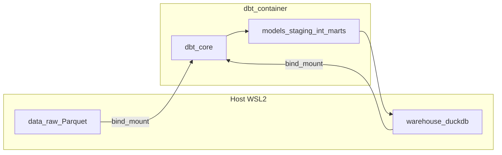

<!-- 47f07b1a-5675-42a5-88e0-87f44a4ad426 -->
---
todos:
  - id: "prereqs"
    content: "Confirm Docker on WSL2; create project under Linux home (not /mnt/c)"
    status: pending
  - id: "docker-dbt"
    content: "Add Dockerfile (or compose) with dbt-core + dbt-duckdb; bind-mount project, data/, warehouse.duckdb"
    status: pending
  - id: "dbt-init-profile"
    content: "Init dbt project; add profiles.yml (DuckDB path); dbt debug in container"
    status: pending
  - id: "staging-parquet"
    content: "sources.yml + staging models using read_parquet globs; early filters for subset"
    status: pending
  - id: "marts-tests-docs"
    content: "int + two marts; tests; dbt docs lineage"
    status: pending
  - id: "incremental"
    content: "Incremental model; add new month partition; verify idempotency"
    status: pending
  - id: "optional-http"
    content: "Optional: httpfs + one HTTPS Parquet source; compare vs local"
    status: pending
isProject: false
---
# Step-by-step: Docker + dbt + DuckDB (NYC TLC scale)

## Prerequisites (one-time)

1. **WSL2 + Linux home directory** — Keep the whole project under your Linux filesystem (e.g. `/home/bocallaghan/...`), not `/mnt/c/...`, for faster Docker bind mounts.
2. **Docker** — Docker Desktop (WSL2 backend) or Docker Engine; confirm `docker run hello-world` works.
3. **Git** (optional) — To version your dbt project.

## Phase 0 — Choose data volume (keep first runs short)

- **Start small**: 1–3 months of one TLC dataset (e.g. yellow or green taxi) so `dbt build` finishes in minutes while you learn wiring.
- **Scale up**: Add more `year=/month=` partitions until runs take long enough to matter (your 32 GB RAM supports multi‑GB Parquet comfortably).

**Getting Parquet**: Use whatever path you prefer that lands **columnar files on disk** under a stable folder (e.g. `data/raw/...`). Many practitioners sync from an official or community mirror; if you only find CSV, convert once with DuckDB or another tool—your dbt project can still treat **local Parquet** as the source of truth.

Suggested on-disk layout (you standardize raw paths in staging):

```text
project/
  data/raw/tlc/yellow/year=2024/month=01/*.parquet
  data/raw/tlc/yellow/year=2024/month=02/*.parquet
  ...
  warehouse.duckdb          # created by dbt; persist via volume
  dbt_project/
    dbt_project.yml
    models/ ...
    profiles.yml            # often gitignored; see below
```

## Phase 1 — Container image that runs dbt + DuckDB

**Goal**: A reproducible environment with `dbt-core` and `dbt-duckdb` (Python 3.10+ is typical).

1. Add a **`Dockerfile`** (conceptually) that:
   - Uses a slim Python base.
   - `pip install dbt-core dbt-duckdb` (pin versions in `requirements.txt` if you want stability).
   - Sets `WORKDIR` to `/usr/app` (or similar).
2. **Build**: `docker build -t dbt-duckdb:local .`
3. **Run pattern** (bind mounts):
   - Mount your **dbt project** (read/write for `target/`, logs).
   - Mount **`data/raw`** read-only if you like.
   - Mount a **named volume or host file** for `warehouse.duckdb` so drops of the container do not erase the DB.

Example **run** shape (adjust paths):

```bash
docker run --rm -it \
  -v "$PWD/dbt_project:/usr/app" \
  -v "$PWD/data:/data:ro" \
  -v "$PWD/warehouse.duckdb:/usr/app/warehouse.duckdb" \
  -w /usr/app \
  dbt-duckdb:local dbt --version
```

Optional: add **`docker-compose.yml`** with the same mounts and a default `command: dbt build` for one-command runs.

## Phase 2 — dbt project + DuckDB profile

1. **Initialize** (inside the container or locally): `dbt init` → choose DuckDB if prompted, or hand-craft a minimal layout.
2. **`profiles.yml`** (usually **not** committed; use `profiles.yml.example` in git):

   - **Driver**: DuckDB.
   - **Path**: `warehouse.duckdb` (relative to project `WORKDIR` inside the container).
   - **Extensions** (optional later): e.g. `httpfs` if you add Phase 5.

3. **Sanity check**: `dbt debug` inside the container must pass (adapter, profile, project dir).

## Phase 3 — `sources` + staging over Parquet

**Goal**: All raw access lives in `staging`; downstream models never hard-code paths scattered everywhere.

1. Define **`sources.yml`** with tables that represent **logical** raw inputs (e.g. `raw.tlc_yellow_trips`), even if DuckDB will implement them as views over files.
2. Implement **`stg_tlc__yellow_trips.sql`** (name as you like) that:
   - Reads via DuckDB’s `read_parquet` with a **glob** matching your folder convention.
   - Casts timestamps and types; renames columns to a consistent convention (`snake_case`).
   - Applies **early filters** for your practice subset (e.g. one month) to keep iteration fast.

Document the **grain** in a short model description (e.g. one row per trip).

## Phase 4 — Intermediate + marts (full refresh)

1. **`int_trips`** (example): Business-clean grain—handle null IDs, outliers, unify dimensions you care about (pickup/dropoff time, borough flags if enriched later).
2. **Mart A — aggregated**: Daily revenue-ish metrics (`mart_taxi__daily_pickups` / trip counts / fare totals by day and flag).
3. **Mart B — dimensional**: Narrower mart for a slice (e.g. by payment type, VendorID) suitable for BI-style querying.

Run: `dbt run --full-refresh` until clean.

## Phase 5 — Tests and docs

1. **Tests**: `unique` + `not_null` on invented **surrogate keys** or stable natural keys; `accepted_values` on low-cardinality fields; add **relationships** only where cardinality is sane (avoid joining explosions on massive keys during every test run).
2. **Docs**: `dbt docs generate` then `dbt docs serve` (or publish artifacts); confirm lineage from raw staging through marts.

## Phase 6 — Incremental practice (simulate new partitions)

**Goal**: Mimic landing new monthly Parquet folders without full history rebuild.

1. Pick an **incremental model** candidate (often a large aggregated table or cleaned fact persisted as table).
2. Configure incremental strategy appropriate for **`dbt-duckdb`** (check your pinned adapter docs for `merge` / `delete+insert` / `append` support for your version).
3. **Exercise loop**:
   - Full refresh with months 01–02.
   - Add month 03 files to `data/raw/...`.
   - Run incremental; confirm row counts and idempotency (re-run should not duplicate).

## Phase 7 — Optional: HTTP Parquet (second network)

After local Parquet is boring:

1. Enable DuckDB **`httpfs`** (and configure in profile/macros as needed).
2. Replace **one** small staging read with `read_parquet('https://...')` **with predicates** if possible.
3. Compare: runtime variance, failure modes, and reproducibility vs local files.

## Phase 8 — Hardening checklist (what “done” looks like)

- `dbt build` succeeds from a **clean** `warehouse.duckdb` + raw data.
- Staging is the **only** layer that knows file paths / globs.
- At least **one** incremental model with a documented **unique key** and backfill story.
- `README.md` documents: how to download/place data, exact `docker`/`docker compose` commands, and where `profiles.yml` lives.



## Effort guide

- **Days 1–3**: Docker image, `dbt debug`, staging over globs.
- **Days 4–7**: Full-refresh marts + tests + docs.
- **Days 8–10**: Incremental + partition add simulation.
- **Days 11+**: Scale months/rows; optional HTTP source.

No code or files will be created until you switch to Agent mode and ask for implementation in your workspace; this document is the ordered checklist to follow manually or to automate next.
